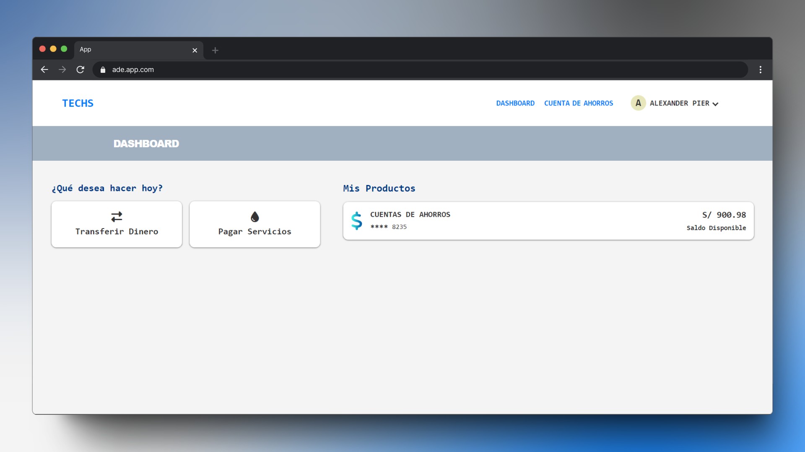

# <h1 align="center">ade.app.com</h1>


## Tecnologías

**FrontEnd:** 


**Backend:** 

**Base de Datos:** 

**Servidor:** 

## Utilizar y probar el proyecto

1. Clonar el proyecto

```bash
  git clone https://github.com/Amed-Dev/ade.bank.app.git
```

2. Dirijete al directorio del proyecto

```bash
  cd ade.bank.app
```

3. Configura el virtualhost dentro de  `/xampp/apache/conf/extra` en el archivo `httpd-vhosts.conf`

4. Inicia el servidor apache y a probar 😎